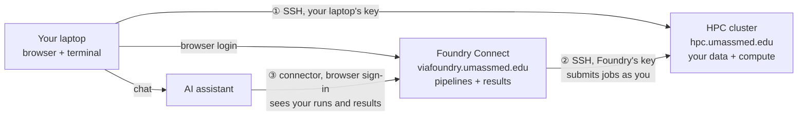

# Session 1 — AI Foundations & Responsible AI

**Friday, September 18, 2026 · 1:00 to 4:00 pm · Amphitheater II (S4-102)**

*Opens with introductions and a 45-minute setup (accounts, SSH keys, Foundry Connect, the AI connector), then the "why" before the "how." Enough theory of AI to use it well, and the responsible-use discipline that runs through the whole bootcamp.*

## Expected learning outcome

Explain — at an intuition level — what LLMs/ML models are and why they hallucinate, and apply the rules for using AI responsibly in a research (and patient-data) setting.

## Welcome and introductions (~5 min, Alper)

Alper opens for the Biocore team (Manuel Garber, Ozkan Aydemir, Alper Kucukural) and introduces the two guest speakers who teach today.

| Guest | Role | Teaches today |
|---|---|---|
| **Eric Ma** | Senior Principal Data Scientist, Moderna | Part A: how AI actually works |
| **Ming "Tommy" Tang** | Director of Bioinformatics, AstraZeneca | Part B: responsible AI |

- **Eric Ma** leads the Data Science and AI Research team at Moderna, working on Bayesian methods for drug discovery. PhD in Biological Engineering from MIT, previously at the Novartis Institutes for BioMedical Research. Core developer on NetworkX and PyMC, and author of the open-source packages pyjanitor and nxviz.
- **Ming "Tommy" Tang** brings fourteen years in computational biology across single-cell genomics, epigenomics, and spatial transcriptomics, and was previously Director of Computational Biology at Immunitas Therapeutics. Teaches bioinformatics to more than 100,000 followers through the Chatomics newsletter, blog, and YouTube channel, alongside widely used RNA-seq, ChIP-seq, and scRNA-seq analysis notes.

**Why these two, for these parts** (a line for the intro): Eric builds probabilistic models for a living, which is the right lens for Part A, where a model *predicts* rather than *looks things up*. Tommy runs bioinformatics inside a pharma company, where data governance and verification are daily practice, which is the right lens for Part B.

> _TODO: confirm with Eric and Tommy that the bios are current, and whether each joins in person or remotely (if remote, test the room's A/V link before 1:00)._

## Part 0: Setup and verification (~40 min, Alper)

*Replaces the long Linux session of the old bootcamp with only what you need for the next six weeks.*

**Outcome:** every participant leaves Part 0 with **four green lights** (Foundry Connect login, SSH to the cluster, Foundry Connect able to run jobs on the cluster as you, and an AI assistant that can see your Foundry Connect runs) and a clear picture of *where* each thing runs.

| Block | Time |
|---|---|
| Where things run (mental model) | 4 min |
| Step 1: Foundry Connect login | 2 min |
| Step 2: SSH key, laptop to cluster, plus the only CLI you need | 12 min |
| Step 3: Foundry Connect to cluster | 10 min |
| Step 4: AI assistant to Foundry Connect | 7 min |
| Verification: four green lights | 5 min |

### Before you arrive (send with the one-week reminder)

1. **Request your HPC cluster account now:** [request form](https://hpc.umassmed.edu/doc/index.php?title=Accounts). Your PI has to approve it, which can take days. If it is not approved by Friday you can still follow along: do Steps 1 and 4, pair with a neighbor for Steps 2 and 3, and finish them from this page once approved.
2. **Log in to Foundry Connect once** at <https://viafoundry.umassmed.edu/> to confirm your account works.
3. **Create your AI assistant account.** _TODO: name the assistant and the approved instance or plan (see instructor notes)._
4. **Bring a charged laptop** with Chrome or Firefox, and know how to open a terminal: **Terminal** on macOS (Spotlight, type "Terminal") or **PowerShell** on Windows (Start menu, type "PowerShell"). No PuTTY needed: Windows 10 and 11 include `ssh`.
5. **Off campus?** The cluster only answers from the UMass Chan network or VPN.

### Where things run (mental model)

Your data and the heavy compute live on the **cluster**. **Foundry Connect** runs pipelines there for you and collects the results. Your **laptop** is a window onto both. The **AI assistant** never touches the cluster directly; it sees what the Foundry Connect connector exposes, which is your runs, their parameters, and their result files.

Setup today is three connections, and each one is a trust relationship you grant and can revoke:

| # | Connection | What proves it is you | Where you revoke it |
|---|---|---|---|
| ① | Laptop to cluster | Your laptop's SSH key (the private half never leaves your laptop) | HPC portal, Public Keys |
| ② | Foundry Connect to cluster | Foundry's SSH key, added to your HPC account | HPC portal, Public Keys |
| ③ | AI assistant to Foundry Connect | A browser sign-in (OAuth), with no key or token to copy | Foundry Connect, Profile, Connect to Claude |

> This is the first responsible-AI lesson of the day. Connection ③ lets an AI read your runs and results, and anything it reads is sent to the AI provider. Grant it knowingly, on the approved instance, and know where to revoke it. Tommy picks this up in Part B.

Your foundry accounts are created. You can log in to your account at https://viafoundry.umassmed.edu. Please follow the steps below to set up your run environment in Foundry Connect.
Foundry is a platform that allows you to securely process your data on the cluster directly from your chat environment. For more information, please visit: https://viafoundry.umassmed.edu/docs/get-started/

To follow the training
##  1. Create an SSH key in Foundry Connect ## 
a. Go to https://viafoundry.umassmed.edu, click the Log in button (top right), and sign in with your UMass Chan email address and email password.
b. Click your profile avatar (top right) → Credentials tab → Create Credential.
c. Set Credential type to SSH and enter any name.
d. Click Generate Keys for Me, then Save.
e. Next to your new key, click the ⋯ menu → View → Copy to copy your public key. You will paste it into the HPC portal in the next step.

##  2. Add your public key to the HPC portal ## 
a. If you don't have an HPC cluster account, email hpc@umassmed.edu to request one. If you have already requested an account, skip this step.
b. Go to https://hpcportal.umassmed.edu/PublicKeys/Create and paste your public key. To log in, use your UMass Chan email address as the username and your email password.

##  3. Set up your HPC run environment in Foundry Connect ## 
Click your profile avatar (top right) → Run Environments tab. Some of you already have a run environment there.

Your run environment is already listed, you only need to add your SSH key:
a. Open the existing run environment.
b. Select your SSH key.
c. Click Test Connection, then Save Changes.

## 4. Add Foundry Connect to Claude as a custom connector## 
With this connection, you can ask Claude in plain language to find pipelines, launch and track runs, access processed samples, create datasets on the HPC cluster, and explore, plot and summarize or do any ad-hoc analysis using your results without leaving the chat in a secure way.

a. In claude.ai (or Claude for Science), go to Settings → Connectors.
b. Click Add custom connector.
c. Enter the Foundry Connect MCP URL: https://viafoundry.umassmed.edu/mcp
d. Click Connect and authorize.
For more details on using Foundry Connect with chat interfaces, see:
https://viafoundry.umassmed.edu/docs/developer-guides/using-viafoundry-with-claude/claude-for-science/

> **Instructor checks before Friday**
> - Walk Steps 1 to 4 on a fresh test account and capture screenshots. Menu labels come from the old Via Foundry docs and may have moved.
> - Confirm the HPC portal accepts `ed25519` keys. The old bootcamp used `ssh-keygen -t ecdsa -b 521`; switch the commands if it does not.
> - Confirm the UMass instance shows the **Connect to Claude** page and the OAuth sign-in (older builds need a Personal Access Token instead).
> - Decide the AI assistant and plan, and whether custom connectors are available on it (workspace plans may need an admin to enable them).
> - Line up helpers for the room and bring the sticky notes.

## Part A — How AI actually works (intuition, math-light) (Eric)

> _TODO: fill each with a plain-language explanation + one visual._
- What a model *is*: patterns from data, not a database of facts.
- Prediction, not retrieval → why confident-but-wrong (hallucination) happens.
- Training vs. inference; context window; temperature (why answers vary).
- ML vs. deep learning vs. LLMs vs. "agents" — the vocabulary, briefly.
- Foundation models teaser (pointer to Session 6): AlphaFold, scGPT/Geneformer, Enformer.

## Part B — Responsible AI (the heart of this session) (Tommy)

> _TODO: make each a rule + a real example._
- **PHI / data privacy** — never paste patient or unpublished data into public tools; use the approved instance. Prefer an **enterprise-tenanted deployment with training-on-input disabled** — consumer tiers may train on what you paste (cf. the 2023 Samsung leak). *(Critical: skin-biopsy patient data.)*
- **Hallucination & verification** — every citation, number, and claim gets independently checked. Fabricated-reference demo.
- **Authorship & accountability** — AI is not an author; you are responsible for correctness.
- **Disclosure & citation** — disclose tool + version + scope of use.
- **Bias & fairness** — training-data bias propagates to outputs and models.
- **Reproducibility** — log prompts, versions, dates, settings.
- **When NOT to trust AI** — novel reasoning, precise stats, current literature, anything clinically consequential without expert review.
- **Labour vs. judgement** — AI may augment *recoverable* **labour** (formatting, language polishing, transcription against a verified source); it must not substitute for the **judgement** that defines research (framing the question, calling an outlier, interpreting a surprise, answering a reviewer). AI can't bear responsibility for the work.

## Part C — Six AI-literacy competencies (the concrete skills) (Alper)

> _TODO: turn each into a one-line rule + a short demo. Grounded in Zyphur/Instats (see README)._
1. **Citation verification** — check every AI-produced citation against the primary source before it enters your work.
2. **Model & parameter specification** — report model version, temperature, seed, and the prompt; re-run to test stability.
3. **Prompt discipline ("fork in the garden")** — treat prompt choice as an analytic degree of freedom (a p-hacking analogue); prompt-sensitivity-test. *(Revisited in [Session 3](session3-stats-and-visualization.md).)*
4. **Adversarial review with model heterogeneity** — critique with a *different* model family than the one that generated the work.
5. **Sycophancy detection** — AI agreement is not evidence; flat agreement with your framing is a red flag, not a green light.
6. **Structured failure-mode reporting** — report what you checked for, what failed, and the residual risk.

## Activity

> _TODO: hands-on "spot the hallucination / spot the PHI leak" exercise._

## Homework

> _TODO: e.g., draft your lab's 5-line AI-use ground rules._

## Materials

- Slides: _TODO_ · Recording: _TODO_
- Reference: [Nature Methods, "Language models for biological research: a primer" (2024)](https://www.nature.com/articles/s41592-024-02354-y)
- Framework: Zyphur / Instats, [Responsible AI in Research & Research Training](https://github.com/mzyphur/responsible-ai-in-research-training) (CC BY-NC-ND — attribute, don't copy)
